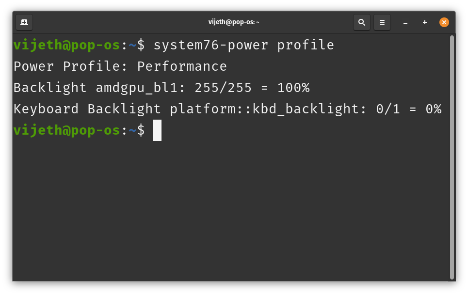
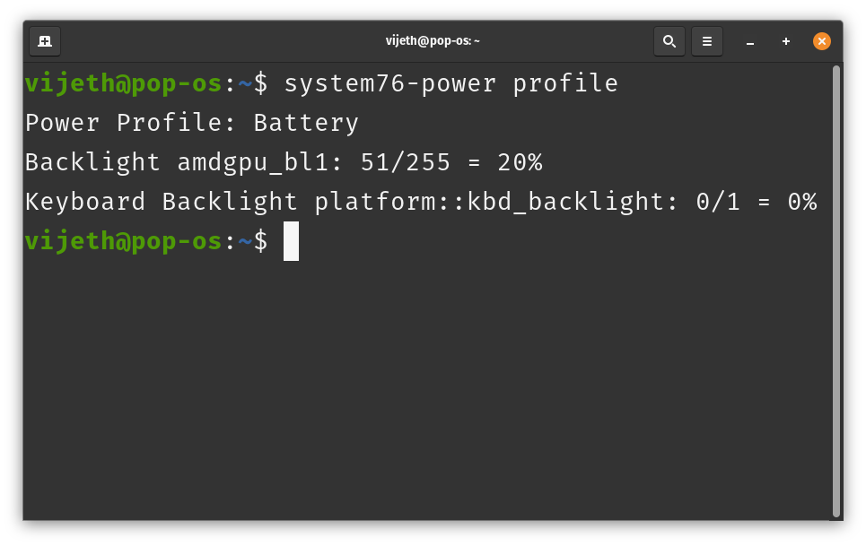

# Pop!_OS Power Tricks: The Art of Automatic Profile Switching
A simple guide to automatic profile switching for optimized performance in Pop!_OS.

First published on [Peerlist](https://peerlist.io/vijethx/articles/popos-automatic-profile-switching)

---

Context :
I've got a 3.75 year old gaming laptop running Pop!_OS 22.04 (which is a fork of Ubuntu) by System76. Now, I used to be all about Windows, but I decided to take the plunge and go full Linux as my daily driver. It's been quite the ride!

I first gave Ubuntu 22.04 a shot, but man, it was missing some stuff I needed and had a few bugs that were driving me nuts. So, I hopped over to Pop!_OS and boom! Problems solved.

Don't get me wrong, I'm loving Pop!_OS, but there are still some Windows goodies I really miss. One of which was auto-switching power profiles on plugging/unplugging my machine. I didn't care much about it initially, but ever since I started using my laptop away from my desk, I felt something essential missing.

That's actually what got me thinking about writing this article.

> Note: I've tried and tested this only on Pop!_OS 22.04 and not on other distributions. This guide/script uses system76-power which is a Power Profile Management tool built in with Pop!_OS. For other distributions, feel free to tweak the script accordingly.

To automatically switch between power modes on Pop!_OS 22.04 when plugging/unplugging your laptop, you can use the system76-power command line tool with an udev rule.

1. Creating a script that will handle the power mode switching (and brightness)

    [Open power-mode-switch.sh](/power-mode-switch.sh)

2. Save this script as `/usr/local/bin/power-mode-switch.sh` and make it executable.

    ```sh
    $ sudo nano /usr/local/bin/power-mode-switch.sh
    # Paste the contents of the script in the text editor, 
    # here I'm using nano. You can use any editor of your choice

    $ sudo chmod +x /usr/local/bin/power-mode-switch.sh
    # Using this to make the file executable
    ```

3. Create an udev rule to trigger this script when the power cable is plugged or unplugged.

    [Open 99-power-mode-switch.rules](/99-power-mode-switch.rules)

    Save this rule as `/etc/udev/rules.d/99-power-mode-switch.rules`

    ```sh 
    $ sudo nano /etc/udev/rules.d/99-power-mode-switch.rules
    ```
4. Reload the udev rules.
    ```sh
    sudo udevadm control --reload-rules
    ```
That's all.

Now, when you unplug your laptop, it will automatically switch to Battery Life mode, and when you plug it in, it should switch to High Performance mode.

To check if the script is working, run

```sh 
$ system76-power profile
```


